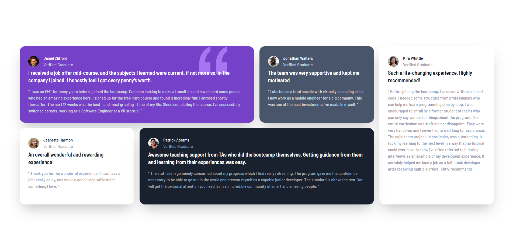

# Testimonials Grid Section

## A responsive grid layout for displaying user testimonials

This project implements a testimonials section composed of five cards arranged in a responsive grid layout. The design focuses on content presentation and visual balance, using CSS grid to control spacing and alignment across different screen sizes.

The project emphasizes layout composition and grid experimentation, ensuring the section remains readable and visually structured on both small and large devices.

### Screenshots

#### Image of the Desktop Design

#### Image of the Mobile Design

### Built with

- [React](https://react.dev/) - JS library
- [TypeScript](https://www.typescriptlang.org/) - type superset of JS
- [Tailwindcss](https://tailwindcss.com/) - utility-first CSS framework

## Author

- Website - [Mihailo Djurovic](portfolio-miahilo.vercel.app)